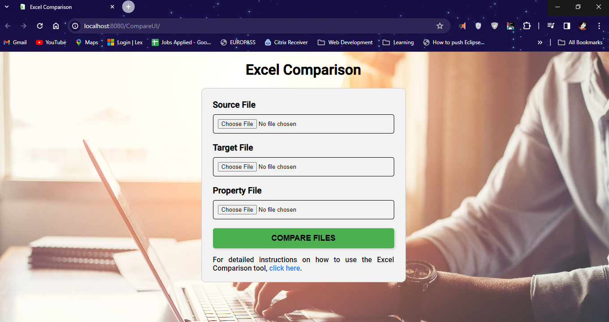

# Excel Comparison Tool

## Overview

The Excel Comparison Tool is a web-based application developed to compare two Excel files column-wise. It allows users to upload a source file, a target file, and a configuration file, and then performs a detailed comparison of the data in the two Excel files based on the provided configuration.

# Images

## Features

- **File Upload**: Users can upload a source Excel file, a target Excel file, and a configuration file.
- **Column-wise Comparison**: The tool compares the data in the two Excel files column-wise, based on the specified columns in the configuration file.
- **Detailed Results**: The comparison results are written to a text file, highlighting any mismatches found between the two files.
- **User Interface**: The tool provides a user-friendly interface for easy navigation and file upload.

## Technologies Used

- **Java Servlets**: Backend processing and comparison logic are implemented using Java servlets.
- **Apache POI**: Used for reading and processing Excel files.
- **HTML, CSS, JavaScript**: Frontend development for user interface and interaction.
- **Log4j**: Logging framework for capturing application logs.

## Specialities of the Java Code

- **Servlet Implementation**: The backend functionality is implemented using Java servlets, providing a robust and scalable solution for handling HTTP requests.
- **File Handling**: The application efficiently handles file uploads and processing using input streams and Apache POI libraries, ensuring compatibility with various file formats.
- **Logging**: Log4j is integrated to capture detailed logs, allowing for easy debugging and monitoring of application behavior.
- **Exception Handling**: The Java code includes comprehensive exception handling to gracefully handle errors and ensure smooth application execution.
- **Modular Design**: The code is well-structured into methods and classes, promoting code reusability and maintainability.
- **Configuration**: The application supports configurable comparison parameters, allowing users to customize the comparison process based on their requirements.

## Usage

1. **Upload Files**: Select the source Excel file, the target Excel file, and the configuration file using the provided form.
2. **Click Compare**: After uploading the files, click on the "COMPARE FILES" button to initiate the comparison process.
3. **View Results**: Once the comparison is completed, a result file will be generated and downloaded automatically.
4. **Alert Message**: Upon completion of the comparison, an alert message will be displayed, indicating that the comparison is completed.

## How to Run

1. **Prerequisites**:
   - Java Development Kit (JDK)
   - Apache Tomcat Server
2. **Deployment**:
   - Deploy the WAR file to the Tomcat server.
3. **Access**:
   - Access the application using the deployed URL in a web browser.

## Contributions

Contributions to this project are welcome. If you find any issues or have suggestions for improvements, feel free to create a pull request or raise an issue in the GitHub repository.

## Copyright

Copyright © 2024 Akshay Tadakod. All Rights Reserved.
